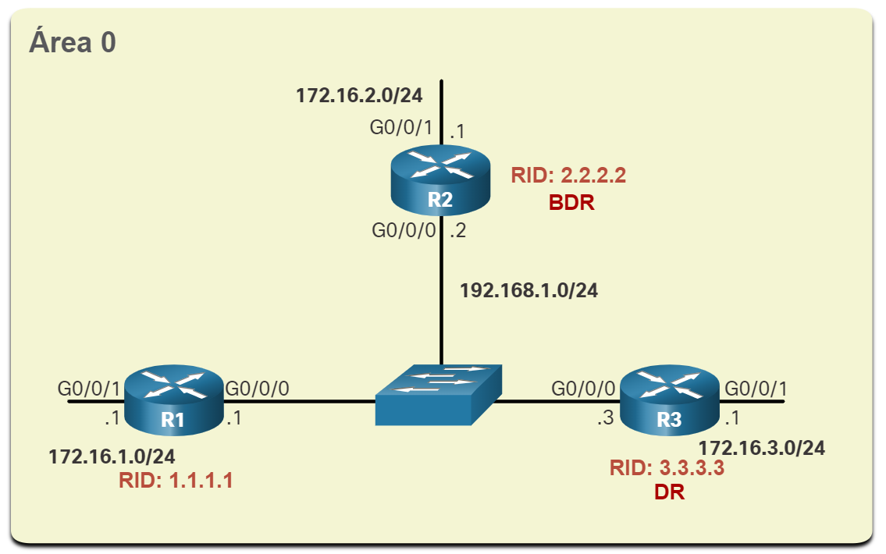

# Comandos OSPF

    # Recursos e características de OSPF
        OSPFv2 é usado para redes IPv4. 
        OSPFv3 é usado para redes IPv6.

    # Componentes do OSPF
            Pacote Hello
            Database Description
            Link-State Request
            Link-State Update
            Pacote de confirmação de link-state
            

        As mensagens OSPF são usadas para criar e manter três bancos de dados OSPF, da seguinte forma:

        Banco de dados de adjacência - Isso cria a tabela de vizinhos.
            - Mostrar tabela de vizinhos
                show ip ospf neighbor

        Banco de dados de estado de link (LSDB) - cria a tabela de topologia.
            - Mostrar tabela de Topologia
                show ip ospf database

        Banco de dados de encaminhamento - Isso cria a tabela de roteamento.
            - Mostrar tabela de roteamento
                show ip route
            

    # Operação Link-State - etapas no processo de roteamento de estado de link

        - Estabelecer Adjacências de Vizinhos
            Os roteadores habilitados para OSPF devem se reconhecer na rede antes que possam compartilhar informações. Um roteador OSPF ativado envia pacotes Hello de todas as interfaces OSPF permitidas para determinar se os vizinhos estão presentes nesses links. Se um vizinho estiver presente, o roteador com OSPF ativado tenta estabelecer uma adjacência de vizinho com aquele vizinho
        
        - Trocar anúncios de estado de link
            Depois que as adjacências são estabelecidas, os roteadores trocam anúncios de estado de link (LSAs). Os LSAs contêm o estado e o custo de cada link diretamente conectado. Os roteadores inundam o LSAs para os vizinhos adjacentes. Os vizinhos adjacentes que recebem o LSA inundam imediatamente todos os outros vizinhos diretamente conectados, até que todos os roteadores da área tenham todos os LSAs.

        - Criar o Banco de Dados de Estado do Link
            Depois que os LSAs são recebidos, os roteadores habilitados para OSPF criam a tabela de topologia (LSDB) com base nos LSAs recebidos. Esse banco de dados contém todas as informações sobre a topologia da área.

        - Executar o algoritmo SPF
            Os roteadores, em seguida, executam o algoritmo SPF. As engrenagens na figura para esta etapa são usadas para indicar a execução do algoritmo SPF. O algoritmo SPF cria a árvore SPF.
            

        - Escolha a melhor rota
           Após a construção da árvore SPF, os melhores caminhos para cada rede são oferecidos para a tabela de roteamento IP. A rota será inserida na tabela de roteamento, a menos que haja uma origem de rota para a mesma rede com uma distância administrativa menor, como uma rota estática. As decisões de roteamento são feitas com base nas entradas da tabela de roteamento. 

    
    # OSPF de área única e multi área
        Para tornar o OSPF mais eficiente e escalável, o OSPF suporta o roteamento hierárquico com o uso de áreas. Uma área OSPF é um grupo de roteadores que compartilham as mesmas informações de link-state nos LSDBs. O OSPF pode ser implementado de uma das duas maneiras a seguir:

        OSPF de área única - Todos os roteadores estão em uma área. A melhor prática é usar a área 0.
        
        OSPF multi área - OSPF é implementado usando várias áreas, de maneira hierárquica. Todas as áreas devem se conectar à área de backbone (área 0). Os roteadores interconectando as áreas são denominados Area Border Routers (ABRs).
        
        O foco deste módulo está no OSPFv2 de área única.

    # OSPF multi área
        Com o OSPF de várias áreas, um domínio de roteamento grande pode ser dividido em áreas menores, para oferecer suporte ao roteamento hierárquico. O roteamento ainda ocorre entre as áreas (roteamento entre áreas), enquanto muitas das operações de roteamento intensivas do processador, como recalcular o banco de dados, são mantidas em uma área.

        Por exemplo, sempre que um roteador recebe novas informações sobre mudanças de topologia na área (incluindo a adição, exclusão ou modificação de um link), o roteador deve executar novamente o algoritmo SPF, criar uma nova árvore SPF e atualizar a tabela de roteamento. O algoritmo SPF exige muito da CPU e o tempo necessário para o cálculo depende do tamanho da área.

        Observação: Os roteadores em outras áreas recebem atualizações sobre alterações na topologia, mas esses roteadores somente atualizam a tabela de roteamento, não executam novamente o algoritmo SPF.

        Muitos roteadores em uma área tornariam o LSDBs muito grande e aumentaria a carga da CPU. Portanto, organizar os roteadores em áreas divide efetivamente um banco de dados potencialmente grande em bancos de dados menores e mais gerenciáveis.

        As opções de design de topologia hierárquica com OSPF de várias áreas podem oferecer as seguintes vantagens:

            - Tabelas de roteamento menores - As tabelas são menores porque há menos entradas de tabela de roteamento. Isso ocorre porque os endereços de rede podem ser resumidos entre áreas. O resumo da rota não é ativado por padrão.
            - Sobrecarga de atualização do estado do link reduzida - Projetar OSPF de várias áreas com áreas menores minimiza os requisitos de processamento e memória.
            - Frequência reduzida de cálculos de SPF - O OSPF de várias áreas localiza o impacto de uma alteração de topologia em uma área. Por exemplo, minimiza o impacto de atualização de roteamento, pois a inundação LSA para na borda de área.
            

    

    # OSPFv3
        OSPFv3 é o equivalente do OSPFv2 para trocar prefixos do IPv6. Lembre-se que no IPv6 o endereço de rede é conhecido como prefixo e a máscara de sub-rede é chamada de tamanho do prefixo.
        Semelhante à sua contraparte do IPv4, o OSPFv3 troca informações de roteamento para preencher a tabela de roteamento IPv6 com prefixos remotos.
        Observação: Com o recurso Famílias de Endereços OSPFv3, o OSPFv3 inclui suporte para IPv4 e IPv6. As linhas de endereço de OSPF não fazem parte do escopo deste currículo.
        O OSPFv2 funcionada na camada de rede do IPv4, comunicando com outros pares IPv4 do OSPF e anunciando somente as rotas IPv4.
        O OSPFv3 tem a mesma funcionalidade que OSPFv2, mas usa o IPv6 como transporte de camada de rede, comunicando com os pares do OSPFv3 e anunciando rotas do IPv6. O OSPFv3 também usa o algoritmo SPF como mecanismo de computação para determinar os melhores caminhos em todo o domínio de roteamento.
        O OSPFv3 possui processos separados de sua contraparte do IPv4. Os processos e as operações são basicamente iguais aos do protocolo de roteamento do IPv4, mas são executados independentemente. OSPFv2 e OSPFv3 têm tabelas de adjacência separadas, tabelas de topologia do OSPF e tabelas de roteamento IP, como mostrado na figura.
        Os comandos de configuração e verificação do OSPFv3 são semelhantes aos usados no OSPFv2.
        

    # Pacotes OSPF
        Tipos de pacotes do OSPF
            Pacotes de estado de link são as ferramentas usadas pelo OSPF para ajudar a determinar a rota mais rápida disponível para um pacote. O OSPF usa os seguintes LSP (link-state packets) para estabelecer e manter adjacências vizinhas e trocar atualizações de roteamento. Cada pacote serve a uma finalidade específica no processo de roteamento OSPF, da seguinte maneira:

            Tipo 1:Pacote de Hello - Isso é usado para estabelecer e manter adjacência com outros roteadores OSPF.
            Tipo 2:Pacote Descrição do Banco de Dados (DBD) - Ele contém uma lista abreviada do LSDB do roteador de envio e é usado pelo recebimento de roteadores para verificar o LSDB local. O LSDB deve ser idêntico em todos os roteadores link-state em uma área para criar uma árvore SPF precisa.
            Tipo 3:Pacote Link-State Request (LSR) - Os roteadores receptores podem solicitar mais informações sobre qualquer entrada no DBD enviando um LSR.
            Tipo 4:Pacote Link-State Update (LSU) - Isso é usado para responder aos LSRs e anunciar novas informações. As LSUs contêm vários tipos diferentes de LSAs.
            Tipo 5:Pacote Link-State Acknowledgement (LSAck) - Quando uma LSU é recebida, o roteador envia um LSAck para confirmar o recebimento da LSU. O campo de dados de LSAck está vazio.
            A tabela resume os cinco tipos diferentes de LSPs usados pelo OSPFv2. O OSPFv3 tem tipos similares de pacote.

            Legenda da tabela
                Tipo	Nome do pacote	                                 Descrição
                1	        Hello	                     Descobre vizinhos e cria adjacências entre eles
                2	 Database Description (DBD)	         Verifica a sincronização de banco de dados entre roteadores
                3	 Link-State Request (LSR)	         Solicita registros específicos de link-state de roteador para roteador
                4	 Link-State Update (LSU)	         Envia registros de link-state especificamente solicitados
                5	 Link-State Acknowledgment (LSAck)	 Confirma os outros tipos de pacotes

    # Atualizações Link State
        Os roteadores trocam inicialmente pacotes DBD Tipo 2, que é uma lista abreviada do LSDB do roteador remetente. Ele é usado pelo recebimento de roteadores para verificar com o LSDB local.
        Um pacote de LSR tipo 3 é usado pelos roteadores de recepção para solicitar mais informações sobre uma entrada na DBD.
        O pacote de LSU tipo 4 é usado para responder a um pacote de LSR.
        Um pacote tipo 5 é usado para confirmar o recebimento de um LSU tipo 4.
        LSUs também são usados para encaminhar atualizações de roteamento do OSPF, como mudanças de link. Especificamente, um pacote LSU pode conter 11 tipos diferentes de LSAs OSPFv2, com alguns dos mais comuns mostrados na figura. O OSPFv3 renomeou vários LSAs e também contém dois LSAs adicionais.
        Observação: Às vezes, a diferença entre os termos LSU e LSA pode ser confusa porque esses termos são frequentemente usados \u200b\u200bde forma intercambiável. No entanto, uma LSU contém um ou mais LSAs.
        

    # Pacote Hello
        O pacote OSPF tipo 1 é o pacote de Hello. Os pacotes Hello são usados para:
        Descobrir vizinhos do OSPF e estabelecer adjacências de vizinhos.
        Anunciar parâmetros nos quais dois roteadores devem concordar para se tornarem vizinhos.
        Escolha o roteador designado (DR) e o roteador designado para backup (BDR) em redes multiacesso como Ethernet. Os links de ponto a ponto não exigem DR ou BDR.    

        - Conteúdo do pacote Hello do OSPF
            

    # Configuração OSPFv2 enm área única

        Objetivo do módulo: Implementar o OSPFv2 de área única nas redes de multiacesso broadcast e ponto a ponto.

                                 Legenda da tabela
            Título do Tópico	                            Objetivo do Tópico
            ID do roteador OSPF	                Configurar uma ID de roteador OSPF.
            Redes OSPF ponto a ponto	        Configurar OSPFv2 de área única em uma rede ponto a ponto.
            Redes OSPF de multiacesso	        Configurar a prioridade da interface OSPF para influenciar a eleição de DR/BDR em uma rede multiacesso.
            Modificar OSPFv2 de área única	    Implementar modificações para alterar a operação de OSPFv2 de área única.
            Propagação de rota padrão	        Configurar o OSPF para propagar uma rota padrão.
            Verificar o OSPFv2 de área única	Verificar uma implementação de OSPFv2 de área única.

    
    # Topologia de Referência de OSPF
       Para começar, este tópico discute a base na qual o OSPF baseia todo seu processo, o ID do roteador OSPF.
        A figura mostra a topologia usada para configurar o OSPFv2 nesse módulo. Os roteadores na topologia têm uma configuração inicial, incluindo endereços de interface. No momento, não há roteamento estático ou dinâmico configurado em qualquer um dos roteadores. Todas as interfaces em R1, R2 e R3 (exceto o loopback 1 no R2) estão dentro da área de backbone do OSPF. O roteador ISP é usado como gateway para a Internet do domínio de roteamento.
        Observação: Nesta topologia, a interface de loopback é usada para simular o link WAN à Internet e uma LAN conectada a cada roteador. Isso é feito para permitir que essa topologia seja duplicada para fins de demonstração em roteadores que têm apenas duas interfaces Gigabit Ethernet. 

        
    
    # Modo de configuração do roteador para OSPF
        OSPFv2 é ativado usando o comando do modo de configuração global router ospf process-id, como mostrado na janela de comando para R1. O valor process-id representa um número entre 1 e 65.535 e é selecionado pelo administrador da rede. O valor process-id é localmente significativo, o que significa que ele não precisa ter o mesmo valor nos outros roteadores OSPF para estabelecer adjacências com esses vizinhos. É considerado prática recomendada usar o mesmo process-id em todos os roteadores OSPF.

        Depois de inserir o comando router ospf process-id, o roteador entra no modo de configuração do roteador, conforme indicado pelo R1(config-router)# prompt. Entre com o sintal de interrogação (? ), para ver todos os comandos disponíveis neste modo. A lista de comandos mostrada aqui foi alterada para exibir apenas os comandos relevantes para este módulo.

        R1(config)# router ospf 10
        R1(config-router)# ?
        area                   OSPF area parameters
        auto-cost              Calculate OSPF interface cost according to bandwidth
        default-information    Control distribution of default information
        distance               Define an administrative distance
        exit                   Exit from routing protocol configuration mode
        log-adjacency-changes  Log changes in adjacency state
        neighbor               Specify a neighbor router
        network                Enable routing on an IP network
        no                     Negate a command or set its defaults
        passive-interface      Suppress routing updates on an interface
        redistribute           Redistribute information from another routing protocol
        router-id              router-id for this OSPF process
        R1(config-router)#

    # IDs do roteador
        Um ID de roteador OSPF é um valor de 32 bits, representado como um endereço IPv4. O ID do roteador é usado para identificar exclusivamente um roteador OSPF. Todos os pacotes OSPF incluem o ID do roteador de origem. Cada roteador requer uma ID de roteador para participar de um domínio OSPF. A ID do roteador pode ser definida por um administrador ou atribuída automaticamente pelo roteador. O ID do roteador é usado por um roteador habilitado para OSPF para fazer o seguinte:

        Participar da sincronização de bancos de dados OSPF — Durante o estado do Exchange, o roteador com o ID de roteador mais alto enviará seus pacotes de descritor de banco de dados (DBD) primeiro.
        Participar da eleição do roteador designado (DR) - Em um ambiente LAN multiacesso, o roteador com o ID de roteador mais alto é eleito o DR. O dispositivo de roteamento com o segundo ID de roteador mais alto é eleito o roteador designado de backup (BDR).
        Observação: O processo eleitoral de DR e BDR é discutido com mais detalhes mais adiante neste módulo.

    # Ordem de precedência da ID do roteador
        Mas como o roteador determina a ID do roteador? Como ilustrado na figura, os roteadores Cisco derivam a ID do roteador com base em um dos três critérios, na seguinte ordem preferencial:

        - O ID do roteador é configurado explicitamente usando o comando do modo de configuração do roteador OSPF router-id rid . O valor rid é qualquer valor de 32 bits expresso como um endereço IPv4. Este é o método recomendado para atribuir uma ID do roteador.
        - Se a ID do roteador não for configurada explicitamente, o roteador escolhe o maior endereço IPv4 de qualquer interface de loopback configurada. Essa é a melhor alternativa para atribuir uma ID do roteador.
        - Se nenhuma interface de loopback estiver configurada, o roteador escolhe o maior endereço IPv4 ativo de algumas das suas interfaces físicas. Esse é o método menos recomendado, pois, para os administradores, isso dificulta a diferenciação entre roteadores específicos.

        

    # Configurar uma interface de loopback como o ID do roteador
        Na topologia de referência, somente as interfaces físicas são configuradas e ativas. As interfaces de loopback não foram configuradas. Quando o roteamento OSPF está habilitado no roteador, os roteadores escolhem o seguinte endereço IPv4 mais ativo configurado como o ID do roteador.

        R1: 10.1.1.14 (G0/0/1)
        R2: 10.1.1.9 (G0/0/1)
        R3: 10.1.1.13 (G0/0/0)
        Observação:O OSPF não precisa ser habilitado em uma interface para que essa interface seja escolhida como o ID do roteador.
        Em vez de depender da interface física, o ID do roteador pode ser atribuído a uma interface de loopback. Normalmente, o endereço IPv4 para esse tipo de interface de loopback deve ser configurado usando uma máscara de sub-rede de 32 bits (255.255.255.255). Isso cria efetivamente uma rota de host. Uma rota de host de 32 bits não seria anunciada como uma rota para outros roteadores OSPF.
        O exemplo mostra como configurar uma interface de loopback em R1. Assumindo que o ID do roteador não foi explicitamente configurado ou aprendido anteriormente, o R1 usará o endereço IPv4 1.1.1.1 como ID do roteador. Suponha que R1 ainda não tenha aprendido um ID de roteador.

        R1(config-if)# interface Loopback 1
        R1(config-if)# ip address 1.1.1.1 255.255.255.255
        R1(config-if)# end
        R1# show ip protocols | include Router ID
        Router ID 1.1.1.1
        R1#

    # Configurar explicitamente um ID de roteador
        Na figura, a topologia foi atualizada para mostrar o ID do roteador para cada roteador:
        R1 usa o ID do roteador 1.1.1.1
        R2 usa o ID do roteador 2.2.2.2
        R3 usa o ID do roteador 3.3.3.3

        

        Use o comando router-id rid router no modo de configuração, para atribuir manualmente um ID de roteador. No exemplo, o ID do roteador 1.1.1.1 é atribuído ao R1. Use o comando show ip protocols para verificar o ID do roteador.

        R1(config)# router ospf 10
        R1(config-router)# router-id 1.1.1.1
        R1(config-router)# end
        *May 23 19:33:42.689: %SYS-5-CONFIG_I: Configured from console by console
        R1# show ip protocols | include Router ID
        Router ID 1.1.1.1
        R1#

    # Modificar uma identificação de roteador
        Depois que um roteador seleciona um ID de roteador, um roteador OSPF ativo não permite que o ID do roteador seja alterado até que o roteador seja recarregado ou o processo OSPF seja redefinido.
        Por exemplo, para R1, o ID do roteador configurado foi removido e o roteador recarregado. Observe que o ID do roteador atual é 10.10.1.1, que é o endereço IPv4 Loopback 0. A ID do roteador deve ser 1.1.1.1. Portanto, R1 é configurado com o comando router-id 1.1.1.1.
        Observe como uma mensagem informativa aparece informando que o processo OSPF deve ser limpo ou que o roteador deve ser recarregado. O motivo é que o R1 já possui adjacências com outros vizinhos usando o ID do roteador 10.10.1.1. Essas adjacências devem ser renegociadas usando a nova ID do roteador 1.1.1.1. Use o comando clear ip ospf process para redefinir as adjacências. Em seguida, você pode verificar se o R1 está usando o novo comando ID do roteador com o comando show ip protocols canalizado para exibir somente a seção ID do roteador.
        O método preferencial é apagar o processo do OSPF para redefinir a ID do roteador.

        R1# show ip protocols | include Router ID
        Router ID 10.10.1.1
        R1# conf t
        Enter configuration commands, one per line.  End with CNTL/Z.
        R1(config)# router ospf 10 
        R1(config-router)# router-id 1.1.1.1
        % OSPF: Reload or use "clear ip ospf process" command, for this to take effect
        R1(config-router)# end
        R1# clear ip ospf process
        Reset ALL OSPF processes? [no]: y
        *Jun  6 01:09:46.975: %OSPF-5-ADJCHG: Process 10, Nbr 3.3.3.3 on GigabitEthernet0/0/1 from FULL to DOWN, Neighbor Down: Interface down or detached
        *Jun  6 01:09:46.975: %OSPF-5-ADJCHG: Process 10, Nbr 2.2.2.2 on GigabitEthernet0/0/0 from FULL to DOWN, Neighbor Down: Interface down or detached
        *Jun  6 01:09:46.981: %OSPF-5-ADJCHG: Process 10, Nbr 3.3.3.3 on GigabitEthernet0/0/1 from LOADING to FULL, Loading Done
        *Jun  6 01:09:46.981: %OSPF-5-ADJCHG: Process 10, Nbr 2.2.2.2 on GigabitEthernet0/0/0 from LOADING to FULL, Loading Done
        R1# show ip protocols | include Router ID
        Router ID 1.1.1.1
        R1#

        Observação: O comando router-id é o método preferido. No entanto, algumas versões mais antigas do IOS não reconhecem o comando router-id; portanto, a melhor maneira de definir o ID do roteador nesses roteadores é usando uma interface de loopback.

    
    # Redes OSPF ponto a ponto
        A sintaxe do comando de rede
        Um tipo de rede que usa OSPF é a rede ponto a ponto. Você pode especificar as interfaces que pertencem a uma rede ponto a ponto configurando o comando network. Você também pode configurar o OSPF diretamente na interface com o comando ip ospf, como veremos mais tarde.

        Ambos os comandos são usados para determinar quais interfaces participam do processo de roteamento para uma área OSPFv2. A sintaxe básica para o comando network é a seguinte:

        Router(config-router)# network network-address wildcard-mask area area-id

        A sintaxe de máscara curinga do endereço de rede é usada para ativar o OSPF nas interfaces. network comandos de estão habilitados para enviar e receber pacotes OSPF.
        A sintaxe da área de identificação de área refere-se à área OSPF. area o comando network deve ser configurado com o mesmo valor area-id em todos os roteadores. Embora qualquer ID de área possa ser usado, é recomendado usar uma ID de área 0 com o OSPFv2 de área única. Essa convenção facilita uma posterior alteração da rede para compatibilidade com o OSPFv2 multiáreas.

    # A máscara curinga
        A máscara curinga geralmente é o inverso da máscara de sub-rede configurada nessa interface. Em uma máscara de sub-rede, o binário 1 é igual a uma correspondência e o binário 0 não é uma correspondência. Em uma máscara curinga, o inverso é verdadeiro, como mostrado aqui:

        - Máscara curinga bit 0 - Corresponde ao valor de bit correspondente no endereço.
        - Máscara curinga bit 1 - Ignora o valor do bit correspondente no endereço.

        O método mais fácil para calcular uma máscara curinga é subtrair a máscara de sub-rede da rede de 255.255.255.255, conforme mostrado nas máscaras de sub-rede / 24 e / 26 da figura.
        O gráfico mostra os cálculos de máscara curinga para duas máscaras de sub-rede fornecidas. Mostrado primeiro é o cálculo de uma máscara curinga para / 24. Escrito no topo é 255.255.255.255. A máscara de sub-rede de 255.255.255.0 é subtraída abaixo, resultando em uma máscara curinga de 0.0.255. A seguir é mostrado o cálculo de uma máscara curinga para /26. Escrito no topo é 255.255.255.255. A máscara de sub-rede de 255.255.255.192 é subtraída abaixo, resultando em uma máscara curinga de 0.0.0.63.

        

    # Configurar o OSPF Usando o comando network
        No modo de configuração de roteamento, há duas maneiras de identificar as interfaces que participarão do processo de roteamento OSPFv2. A figura mostra a topologia de referência.

        

        No primeiro exemplo, a máscara curinga identifica a interface com base nos endereços de rede. Qualquer interface ativa configurada com um endereço IPv4 pertencente a essa rede participará do processo de roteamento OSPFv2.

        R1(config)# router ospf 10
        R1(config-router)# network 10.10.1.0 0.0.0.255 area 0
        R1(config-router)# network 10.1.1.4 0.0.0.3 area 0
        R1(config-router)# network 10.1.1.12 0.0.0.3 area 0
        R1(config-router)#
        Observação: Algumas versões do IOS permitem que a máscara de sub-rede seja inserida em vez da máscara curinga. O IOS converte a máscara de sub-rede para o formato da máscara curinga.

        Como alternativa, o segundo exemplo mostra como o OSPFv2 pode ser habilitado especificando o endereço IPv4 exato da interface usando uma máscara curinga quad zero. Inserir network 10.1.1.5 0.0.0.0 area 0 em R1 diz ao roteador para ativar a interface Gigabit Ethernet 0/0/0 para o processo de roteamento. Como resultado, o processo OSPFv2 anunciará a rede que está nessa interface (10.1.1.4/30).

        R1(config)# router ospf 10
        R1(config-router)# network 10.10.1.1 0.0.0.0 area 0
        R1(config-router)# network 10.1.1.5 0.0.0.0 area 0
        R1(config-router)# network 10.1.1.14 0.0.0.0 area 0
        R1(config-router)#
        A vantagem de especificar a interface é que o cálculo da máscara curinga não é necessário. Observe que em todos os casos, o area argumento especifica a área 0.
    

    # Configurar o OSPF Usando o comando ip ospf
       Você também pode configurar o OSPF diretamente na interface em vez de usar o comando network. Para configurar o OSPF diretamente na interface, use o comando ip ospf interface configuration mode. A sintaxe é a seguinte:

        Router(config-if)# ip ospf process-id area area-id
        Para R1, remova os comandos de rede usando esta forma no dos comandos network. E, em seguida, vá para cada interface e configure o comando ip ospf, como mostrado na janela de comando.

        R1(config)# router ospf 10
        R1(config-router)# no network 10.10.1.1 0.0.0.0 area 0
        R1(config-router)# no network 10.1.1.5 0.0.0.0 area 0
        R1(config-router)# no network 10.1.1.14 0.0.0.0 area 0
        R1(config-router)# interface GigabitEthernet 0/0/0
        R1(config-if)# ip ospf 10 area 0
        R1(config-if)# interface GigabitEthernet 0/0/1 
        R1(config-if)# ip ospf 10 area 0
        R1(config-if)# interface Loopback 0
        R1(config-if)# ip ospf 10 area 0
        R1(config-if)# 

    # Interface Passiva
        Por padrão, as mensagens OSPF são encaminhadas para todas as interfaces com OSPF. No entanto, essas mensagens realmente precisam ser enviadas apenas para interfaces conectadas a outros roteadores habilitados para OSPF.
        Consulte a topologia na figura. As mensagens OSPFv2 são encaminhadas pelas três interfaces de loopback, embora nenhum vizinho OSPFv2 exista nessas LANs simuladas. Em uma rede de produção, esses loopbacks seriam interfaces físicas para redes com usuários e tráfego. O envio de mensagens desnecessárias em uma LAN afeta a rede de três maneiras, da seguinte maneira:
        Uso ineficiente da largura de banda - A largura de banda disponível é consumida transportando mensagens desnecessárias.
        Uso ineficiente de recursos - Todos os dispositivos na LAN devem processar e, eventualmente, descartar a mensagem.
        Aumento do risco de segurança - Sem configurações de segurança OSPF adicionais, as mensagens OSPF podem ser interceptadas com software de detecção de pacotes. As atualizações de roteamento podem ser modificadas e enviada de volta ao roteador, o que corrompe a tabela de roteamento com métricas falsas que desorientam o tráfego.

        

    # Configurar interfaces passivas
        Use o comando do modo de configuração do roteador passive-interface impedir a transmissão de mensagens de roteamento por meio de uma interface de roteador, mas ainda permitir que essa rede seja anunciada para outros roteadores. O exemplo de configuração identifica a interface R1 Loopback 0/0/0 como passiva.

        O comando show ip protocols é então usado para verificar se a interface Loopback 0 está listada como passiva. A interface ainda está listada no título "Roteamento em interfaces configuradas explicitamente (área 0)", o que significa que essa rede ainda está incluída como uma entrada de rota nas atualizações do OSPFv2 enviadas para R2 e R3.

        # Configurar todas as interfaces como passivas com um comando
            R3(config)#router ospf 10
            R3(config-router)#passive-interface default

        # Verificar a configuração das interfaces
            show ip protocols

    
    # Redes ponto a ponto OSPF
        Por padrão, os roteadores Cisco elegem um DR e BDR em interfaces Ethernet, mesmo que haja apenas um outro dispositivo no link. Você pode verificar isso com o comando show ip ospf interface, como mostrado no exemplo para G0/0/0 de R1
        R1 é o BDR e R2 é o DR. O processo de eleição DR/ BDR é desnecessário, pois só pode haver dois roteadores na rede ponto a ponto entre R1 e R2. Observe na saída que o roteador designou o tipo de rede como BROOD. Para alterar isso para uma rede ponto-a-ponto, use o comando de configuração de interface ip ospf network point-to-point em todas as interfaces nas quais você deseja desativar o processo de eleição DR/BDR. O exemplo abaixo mostra essa configuração para R1. O status de adjacência do vizinho OSPF ficará inativo por alguns milissegundos.

        R1(config)# interface GigabitEthernet 0/0/0
        R1(config-if)# ip ospf network point-to-point

        R1(config-if)# interface GigabitEthernet 0/0/1
        R1(config-if)# ip ospf network point-to-point 

        Observe que a interface Gigabit Ethernet 0/0/0 agora lista o tipo de rede como POINT_TO_POINT e que não há DR ou BDR no link.

        Usamos loopbacks para fornecer interfaces adicionais para uma variedade de propósitos. Neste caso, estamos usando loopbacks para simular mais redes do que o equipamento pode suportar. Por padrão, as interfaces de loopback são anunciadas como rotas de host /32. Por exemplo, R1 anunciaria a rede 10.10.1.0/24 como 10.10.1.1/32 para R2 e R3.

        R2# show ip route | include 10.10.1 
        O        10.10.1.1/32 [110/2] via 10.1.1.5, 00:03:05, GigabitEthernet0/0/0
        
        Para simular uma LAN real, a interface Loopback 0 é configurada como uma rede ponto a ponto para que R1 anuncie a rede 10.10.1.0/24 completa para R2 e R3.
        R1(config-if)# interface Loopback 0
        R1(config-if)# ip ospf network point-to-point

        Agora R2 recebe o endereço de rede LAN mais preciso e simulado de 10.10.1.0/24.
        R2# show ip route | include 10.10.1
        O        10.10.1.0/24 [110/2] via 10.1.1.5, 00:00:30, GigabitEthernet0/0/0

    # Redes OSPF de multiacesso
        Tipos de rede OSPF
        Outro tipo de rede que usa OSPF é a rede OSPF multiacesso. As redes OSPF multiacesso são exclusivas, pois um roteador controla a distribuição de LSAs. O roteador que é eleito para essa função deve ser determinado pelo administrador de rede por meio da configuração adequada.
        O OSPF pode incluir processos adicionais dependendo do tipo de rede. A topologia anterior usava links ponto-a-ponto entre os roteadores. No entanto, os roteadores podem ser conectados ao mesmo switch para formar uma rede multiacesso, como mostrado na figura. As LANs Ethernet são o exemplo mais comum de redes multiacesso de broadcast. Nas redes de broadcast, todos os dispositivos na rede enxergam todas as transmissões e quadros multicast.

        

    # Roteador Designado de OSPF
        Lembre-se de que, em redes multiacesso, o OSPF elege um DR e BDR como uma solução para gerenciar o número de adjacências e a inundação de anúncios de estado de link (LSAs). A DR é responsável pela coleta e distribuição de LSAs enviadas e recebidas. O DR usa o endereço IPv4 multicast 224.0.0.5, destinado a todos os roteadores OSPF.
        Um BDR também é eleito em caso de falha do DR. O BDR escuta passivamente e mantém um relacionamento com todos os roteadores. Se o DR parar de produzir de pacotes de Hello, o BDR promove-se e assume a função do DR.
        Todos os outros roteadores se tornam DROTHER (um roteador que não é o DR nem o BDR). Os DROthers usam o endereço de multiacesso 224.0.0.6 (todos os roteadores designados) para enviar pacotes OSPF para DR e BDR. Somente o DR e o BDR escutam para 224.0.0.6.
        Na figura, R1, R5 e R4 são DROthers. Clique em jogar para ver a animação de R2 atuando como DR. Observe que somente o DR e o BDR processam o LSA enviado por R1 usando o endereço IPv4 multicast 224.0.0.6. Em seguida, o DR envia o LSA para todos os roteadores OSPF usando o endereço IPv4 multicast 224.0.0.5.

        

    # Topologia de referência de multiacesso OSPF
        Na topologia de multiacesso mostrada na figura, há três roteadores interconectados em uma rede comum de multiacesso Ethernet, 192.168.1.0/24. Cada roteador é configurado com o endereço IPv4 indicado na interface Gigabit Ethernet 0/0/0.
        Como os roteadores estão conectados por uma rede comum de multiacesso, o OSPF elegeu automaticamente um DR e BDR. Neste exemplo, R3 foi eleito como o DR como o ID do roteador é 3.3.3.3, que é o mais alto em essa rede. O R2 é o BDR porque tem o segundo maior ID de roteador na rede.    

        

    
    # Verificar funções de roteador OSPF
       Para verificar as funções do roteador OSPFv2, use o comando show ip ospf interface.

       R1 DROTHER

        A saída gerada por R1 confirma que o seguinte:

        R1 não é o DR ou o BDR, mas é um DROTHER com a prioridade padrão de 1. (Linha 7)
        O DR é o R3 com a ID do roteador 3.3.3.3 no endereço IPv4 192.168.1.3, enquanto o BDR é o R2 com a ID do roteador 2.2.2.2 no endereço IPv4 192.168.1.2. (Linhas 8 e 9)
        R1 tem duas áreas: uma com o BDR e uma com DR. (Linhas 20-22)
        R1# show ip ospf interface GigabitEthernet 0/0/0
        GigabitEthernet0/0/0 is up, line protocol is up 
        Internet Address 192.168.1.1/24, Area 0, Attached via Interface Enable
        Process ID 10, Router ID 1.1.1.1, Network Type BROADCAST, Cost: 1
        Topology-MTID Cost Disabled Shutdown Topology Name
                0 1 no no Base
        Ativado pela configuração da interface, incluindo endereços IP secundários
        O atraso de transmissão é de 1 seg, DROTHER de estado, Roteador designado (ID) da Prioridade 1 3.3.3, endereço de interface 192.168.1.3
        Roteador Designado de Backup (ID) 2.2.2.2, Endereço de Interface 192.168.1.2
        Timer intervals configured, Hello 10, Dead 40, Wait 40, Retransmit 5
            oob-resync timeout 40
            Olá devido em 00:00:07
        Supports Link-local Signaling (LLS)
        Cisco NSF helper support enabled
        IETF NSF helper support enabled
        Index 1/1/1, flood queue length 0
        Next 0x0(0)/0x0(0)/0x0(0)
        Last flood scan length is 0, maximum is 1
        Last flood scan time is 0 msec, maximum is 1 msec
        Neighbor Count is 2, Adjacent neighbor count is 2 
            Adjacent with neighbor 2.2.2.2 (Backup Designated Router)
            Adjacent with neighbor 3.3.3.3 (Designated Router)
        Suppress hello for 0 neighbor(s)
        R1#

        R2 BDR

        A saída gerada por R2 confirma que:

        R2 é o BDR com a prioridade padrão de 1. (Linha 7)
        O DR é o R3 com a ID do roteador 3.3.3.3 no endereço IPv4 192.168.1.3, enquanto o BDR é o R2 com a ID do roteador 2.2.2.2 no endereço IPv4 192.168.1.2. (Linhas 8 e 9)
        R2 tem duas adjacências; um com um vizinho com ID do roteador 1.1.1.1 (R1) e outro com o DR. (Linhas 20-22)
        R2# show ip ospf interface GigabitEthernet 0/0/0
        GigabitEthernet0/0/0 is up, line protocol is up 
        Endereço Internet 192.168.1.2/24, Área 0, Anexado via Ativação de Interface
        Process ID 10, Router ID 2.2.2.2, Network Type BROADCAST, Cost: 1
        Topology-MTID Cost Disabled Shutdown Topology Name
                0 1 no no Base
        Ativado pela configuração da interface, incluindo endereços IP secundários
        O atraso de transmissão é de 1 seg, BDR de estado, Roteador Designado (ID) da Prioridade 1 3.3.3, Endereço de interface 192.168.1.3
        Roteador Designado de Backup (ID) 2.2.2.2, Endereço de Interface 192.168.1.2
        Timer intervals configured, Hello 10, Dead 40, Wait 40, Retransmit 5
            oob-resync timeout 40
            Hello due in 00:00:01
        Supports Link-local Signaling (LLS)
        Cisco NSF helper support enabled
        IETF NSF helper support enabled
        Index 1/1, flood queue length 0
        Next 0x0(0)/0x0(0)
        Last flood scan length is 0, maximum is 1
        Last flood scan time is 0 msec, maximum is 0 msec
        Neighbor Count is 2, Adjacent neighbor count is 2 
            Adjacent with neighbor 1.1.1.1
            Adjacent with neighbor 3.3.3.3 (Designated Router)
        Suppress hello for 0 neighbor(s)
        R2#

        R3 DR

        A saída gerada por R3 confirma que:

        R3 é o DR com a prioridade padrão de 1. (Linha 7)
        O DR é o R3 com a ID do roteador 3.3.3.3 no endereço IPv4 192.168.1.3, enquanto o BDR é o R2 com a ID do roteador 2.2.2.2 no endereço IPv4 192.168.1.2. (Linhas 8 e 9)
        R3 tem duas adjacências; um com um vizinho com ID do roteador 1.1.1.1 (R1) e outro com o BDR. (Linhas 20-22)
        R3# show ip ospf interface GigabitEthernet 0/0/0
        GigabitEthernet0/0/0 is up, line protocol is up 
        Internet Address 192.168.1.3/24, Area 0, Attached via Interface Enable
        Process ID 10, Router ID 3.3.3.3, Network Type BROADCAST, Cost: 1
        Topology-MTID Cost Disabled Shutdown Topology Name
                0 1 no no Base
        Ativado pela configuração da interface, incluindo endereços IP secundários
        O atraso de transmissão é de 1 seg, DR de estado, Roteador designado (ID) da prioridade 1 3.3.3.3, endereço de interface 192.168.1.3
        Roteador Designado de Backup (ID) 2.2.2.2, Endereço de Interface 192.168.1.2
        Timer intervals configured, Hello 10, Dead 40, Wait 40, Retransmit 5
            oob-resync timeout 40
            Hello due in 00:00:06
        Supports Link-local Signaling (LLS)
        Cisco NSF helper support enabled
        IETF NSF helper support enabled
        Index 1/1/1, flood queue length 0
        Next 0x0(0)/0x0(0)/0x0(0)
        Last flood scan length is 2, maximum is 2
        Last flood scan time is 0 msec, maximum is 0 msec
        Neighbor Count is 2, Adjacent neighbor count is 2 
            Adjacent with neighbor 1.1.1.1
            Adjacent with neighbor 2.2.2.2 (Backup Designated Router)
        Suppress hello for 0 neighbor(s)
        R3#

    # Verifique as adjacências de DR / BDR
        Para verificar as adjacências OSPFv2, use o comando show ip ospf neighbor, como mostrado no exemplo para R1. O estado dos vizinhos nas redes multiacesso pode ser o seguinte:
        FULL/DROTHER -Este é um roteador DR ou BDR totalmente adjacente a um roteador que não seja DR ou BDR. Esses dois vizinhos podem trocar pacotes Hello, atualizações, consultas, respostas e confirmações.
        FULL/DR - O roteador é totalmente adjacente ao vizinho DR indicado. Esses dois vizinhos podem trocar pacotes Hello, atualizações, consultas, respostas e confirmações.
        FULL/BDR - O roteador é totalmente adjacente ao vizinho BDR indicado. Esses dois vizinhos podem trocar pacotes Hello, atualizações, consultas, respostas e confirmações.
        2-WAY/DROTHER - O roteador não DR ou BDR tem um relacionamento de vizinho com outro roteador não DR ou BDR. Estes dois pacotes trocam pacote Hello.
        O estado normal para um roteador OSPF geralmente é FULL. Se um roteador estiver fixo em outro estado, é uma indicação de que há problemas ao formar adjacências. A única exceção a isso é o estado 2-WAY, que é normal em uma rede de transmissão de vários acessos. Por exemplo, os DROTHERs formarão uma adjacência vizinha de 2 vias com quaisquer DROTHERs que ingressarem na rede. Quando isso acontece, o estado vizinho é exibido como 2 WAY/DROTHER.

    # Comando show ip ospf neighbor em cada roteador.
    
        A saída gerada pelo R1 confirma que o R1 possui adjacências com os seguintes roteadores:

        R2 com a identificação do roteador 2.2.2.2 está em um estado Full e a função de R2 é BDR.
        R3 com a identificação do roteador 3.3.3.3 está em um estado Full e a função de R3 é DR.
        R1# show ip ospf neighbor 
        Neighbor ID Pri State Dead Time Address Interface
        2.2.2.2 1 FULL/BDR 00:00:31 192.168.1.2 GigabitEthernet0/0/0
        3.3.3.3 1 FULL/DR 00:00:39 192.168.1.3 GigabitEthernet0/0/0
        R1#

        A saída gerada pelo R2 confirma que o R2 possui adjacências com os seguintes roteadores:

        R1 com uma identificação do roteador 1.1.1.1 está em um estado Full e R1 não é DR nem BDR.
        R3 com a identificação do roteador 3.3.3.3 está em um estado Full e a função de R3 é DR.
        R2# show ip ospf neighbor 
        Neighbor ID Pri State Dead Time Address Interface
        1.1.1.1 1 FULL/DROTHER 00:00:31 192.168.1.1 GigabitEthernet0/0/0
        3.3.3.3 1 FULL/DR 00:00:34 192.168.1.3 GigabitEthernet0/0/0
        R2#

        A saída gerada pelo R3 confirma que o R3 possui adjacências com os seguintes roteadores:

        R1 com uma identificação do roteador 1.1.1.1 está em um estado Full e R1 não é DR nem BDR.
        R2 com a identificação do roteador 2.2.2.2 está em um estado Full e a função de R2 é BDR.
        R3# show ip ospf neighbor 
        Neighbor ID Pri State Dead Time Address Interface
        1.1.1.1 1 FULL/DROTHER 00:00:37 192.168.1.1 GigabitEthernet0/0/0
        2.2.2.2 1 FULL/BDR 00:00:33 192.168.1.2 GigabitEthernet0/0/0
        R3#

    
    # Processo de Eleição do DR/BDR Padrão
        Como o DR e o BDR são eleitos? A decisão da eleição do DR e do BDR do OSPF é baseada nos seguintes critérios, em ordem sequencial:

        Os roteadores na rede elegem o roteador com a prioridade mais alta de interface como o DR. O roteador com a segunda prioridade mais alta da interface é eleito como o BDR. A prioridade pode ser configurada para ser qualquer número entre 0 e 255. Se o valor da prioridade da interface for definido como 0, essa interface não poderá ser escolhida como DR nem BDR. A prioridade padrão de interfaces multiacesso com broadcast é 1. Portanto, a menos que configurados de outra forma, todos os roteadores possuem um valor de prioridade igual e devem se basear em outro método de desempate durante a eleição do DR/BDR.
        Se as prioridades da interface forem iguais, o roteador com a maior identificação de roteador será eleito como o DR. O roteador com a segunda maior identificação do roteador será o BDR.
        Lembre-se de que o ID do roteador é determinado de uma das três maneiras a seguir:

        A ID do roteador pode ser configurada manualmente.
        Se nenhuma ID de roteador estiver configurada, a ID do roteador será determinada pelo endereço IPv4 de loopback mais alto.
        Se nenhuma interface de loopback é configurada, o ID do roteador é determinado pelo endereço IPv4 ativo mais alto.

    
    # Topologia de referência de multiacesso OSPFv2

        

        Na figura, todas as interfaces de roteador Ethernet têm uma prioridade padrão 1. Como resultado, com base nos critérios de seleção listados acima, o ID do roteador OSPF é usado para eleger o DR e o BDR. R3 com o maior ID do roteador torna-se o DR; e R2 com o segundo maior ID do roteador, torna-se o BDR.

        O processo de eleição do DR e do BDR ocorre quando o primeiro roteador com uma interface OSPF habilitada estiver ativo na rede multiacesso. Isso pode acontecer quando os roteadores OSPF pré-configurados são ligados ou quando o OSPF é ativado na interface. O processo de eleição leva apenas alguns segundos. Se todos os roteadores na rede multiacesso não tiverem terminado a reinicialização, é possível que um ID do roteador mais baixo se torne o DR.

        As eleições de DR e BDR do OSPF não são preventivas. Se um novo roteador com uma prioridade mais alta ou um ID de roteador mais alto for adicionado à rede após a eleição do DR e do BDR, o roteador adicionado recentemente não assume o papel de DR ou BDR, porque essas funções já foram atribuídas. A adição de um novo roteador não inicia um processo de eleição novo.

    # Falha e recuperação de DR
        Depois que o DR foi eleito, será o DR até que ocorram um dos seguintes eventos:

        O DR falhar.
        O processo OSPF no DR falha ou é parado.
        A interface do DR falha ou é desligada.
        Se o DR falha, o BDR é atualizado automaticamente ao DR. Esse é o caso se outro DROTHER com um ID do roteador ou maior prioridade é adicionado à rede após a eleição inicial do DR/BDR. No entanto, depois que um BDR é promovido a DR, uma nova eleição de BDR ocorre e o DROTHER com a prioridade mais alta ou o ID do roteador é eleito como o novo BDR.

    # O comando ip ospf priority
        Se as prioridades da interface forem iguais, o roteador com a maior identificação de roteador será eleito como o DR. É possível configurar o ID do roteador para manipular a eleição do DR/BDR. No entanto, esse processo funciona apenas se houver um plano rigoroso de requisitos para definir o ID do roteador em todos os roteadores. Configurar o ID do roteador pode ajudar a controlar isso. No entanto, em grandes redes isso pode ser complicado.

        Em vez de confiar no ID do roteador, é melhor gerenciar a eleição para definir prioridades de interface. Isso também permite que um roteador seja o DR em uma rede e um DROTHER em outra. Para definir a prioridade de uma interface, use o comando ip ospf priority value, onde o valor é de 0 a 255. Um valor de 0 não se torna um DR ou um BDR. Um valor de 1 a 255 na interface torna mais provável que o roteador se torne o DR ou o BDR.  

    # Configurar a prioridade do OSPF
        Na topologia, o comando ip ospf priority será usado para alterar o DR e BDR da seguinte forma:

        R1 deve ser DR e será configurado com uma prioridade 255.
        R2 deve ser BDR e será configurado com uma prioridade 1.
        R3 nunca deve ser um DR ou um BDR e será configurado com uma prioridade 0.
        Altere a prioridade da interface R1 G0/0/0 de 1 para 255.

        R1(config)# interface GigabitEthernet 0/0/0 
        R1(config-if)# ip ospf priority 255 
        R1(config-if)# end 
        R1#
        Altere a prioridade da interface R3 G0/0/0 de 1 para 0.

        R3(config)# interface GigabitEthernet 0/0/0
        R3(config-if)# ip ospf priority 0
        R3(config-if)# end
        R3#
        O exemplo a seguir mostra como limpar o processo de OSPF em R1. O comando clear ip ospf process também deve ser inserido em R2 e R3 (não mostrado). Observe as informações de estado OSPF que são geradas.

        R1# clear ip ospf process
        Reset ALL OSPF processes? [no]: y
        R1#
        *Jun  5 03:47:41.563: %OSPF-5-ADJCHG: Process 10, Nbr 2.2.2.2 on GigabitEthernet0/0/0 from FULL to DOWN, Neighbor Down: Interface down or detached
        *Jun  5 03:47:41.563: %OSPF-5-ADJCHG: Process 10, Nbr 3.3.3.3 on GigabitEthernet0/0/0 from FULL to DOWN, Neighbor Down: Interface down or detached
        *Jun  5 03:47:41.569: %OSPF-5-ADJCHG: Process 10, Nbr 2.2.2.2 on GigabitEthernet0/0/0 from LOADING to FULL, Loading Done
        *Jun  5 03:47:41.569: %OSPF-5-ADJCHG: Process 10, Nbr 3.3.3.3 on GigabitEthernet0/0/0 from LOADING to FULL, Loading Done
        A saída do comando show in ospf interface g0/0/0 em R1 confirma que R1 agora é o DR com uma prioridade 255 e identifica as novas adjacências vizinhas de R1.

        R1# show ip ospf interface GigabitEthernet 0/0/0
        GigabitEthernet0/0/0 is up, line protocol is up 
        Internet Address 192.168.1.1/24, Area 0, Attached via Interface Enable
        Process ID 10, Router ID 1.1.1.1, Network Type BROADCAST, Cost: 1
        Topology-MTID    Cost    Disabled    Shutdown      Topology Name
                0           1         no          no            Base
        Enabled by interface config, including secondary ip addresses
        Transmit Delay is 1 sec, State DR, Priority 255
        Designated Router (ID) 1.1.1.1, Interface address 192.168.1.1
        Backup Designated router (ID) 2.2.2.2, Interface address 192.168.1.2
        Timer intervals configured, Hello 10, Dead 40, Wait 40, Retransmit 5
            oob-resync timeout 40
            Hello due in 00:00:00
        Supports Link-local Signaling (LLS)
        Cisco NSF helper support enabled
        IETF NSF helper support enabled
        Index 1/1/1, flood queue length 0
        Next 0x0(0)/0x0(0)/0x0(0)
        Last flood scan length is 1, maximum is 2
        Last flood scan time is 0 msec, maximum is 1 msec
        Neighbor Count is 2, Adjacent neighbor count is 2 
            Adjacent with neighbor 2.2.2.2  (Backup Designated Router)
            Adjacent with neighbor 3.3.3.3
        Suppress hello for 0 neighbor(s)
        R1#
    
    # Modificar OSPFv2 de área única
        Métrica de Custo do Cisco OSPF
        Lembre-se de que um protocolo de roteamento usa uma métrica para determinar o melhor caminho de um pacote através de uma rede. Uma métrica indica a sobrecarga necessária para enviar pacotes por determinada interface. O OSPF usa o custo como métrica. Um custo menor indica um caminho melhor em vez de um custo mais alto.

        O custo de uma interface da Cisco é inversamente proporcional à largura de banda da interface. Portanto, uma largura de banda maior indica um custo menor. A fórmula usada para calcular o custo do OSPF é:
        Custo = largura de banda de refrencia / largura de banda da interface
        A largura de banda de referência padrão é 108 (100,000,000); portanto, a fórmula é:
        Custo = 100,000,000 bps / largura de banda da interface em bps
        Consulte a tabela para obter uma análise detalhada do cálculo de custos. Como o valor de custo do OSPF deve ser um número inteiro, as interfaces FastEthernet, Gigabit Ethernet e 10 GigE compartilham o mesmo custo. Para corrigir esta situação, você pode:
        Ajuste a largura de banda de referência com o comando auto-cost reference-bandwidth em cada roteador OSPF.
        Defina manualmente o valor de custo do OSPF com o comando ip ospf cost nas interfaces necessárias.

        

        Ajustar a largura de banda de referência
        O valor do custo deve ser um número inteiro. Se algo menor do que um inteiro for calculado, o OSPF arredonda até o inteiro o mais próximo. Portanto, o custo OSPF atribuído a uma interface Gigabit Ethernet com a largura de banda de referência padrão de 100.000.000 bps seria igual a 1, porque o número inteiro mais próximo de 0,1 é 0 em vez de 1.

        Custo = 100,000,000 bps / 1,000,000,000 = 1

        Por esse motivo, todas as interfaces mais rápidas do que a Fast Ethernet terão o mesmo valor de custo de 1 como uma interface Fast Ethernet. Para auxiliar o OSPF a determinar o caminho correto, a largura de banda de referência deve ser alterada para um valor mais alto a fim de acomodar redes com links com velocidade superior a 100 Mbps.

        Alterar a largura de banda de referência não afeta realmente a capacidade da largura de banda no link; em vez disso, afeta o cálculo usado para determinar a métrica. Para ajustar a largura de banda de referência, use o comando router configuration auto-cost reference-bandwidth Mbps.

        Router(config-router)# auto-cost reference-bandwidth Mbps
        Esse comando deve ser configurado em cada roteador no domínio do OSPF. Observe que o valor é expresso em Mbps; portanto, para ajustar os custos para Gigabit Ethernet, use o comando auto-cost reference-bandwidth 1000. For 10 Gigabit Ethernet, use o comando auto-cost reference-bandwidth 10000.

        Para retornar à largura de banda de referência padrão, use o comando auto-cost reference-bandwidth 100.

        Seja qual for o método usado, é importante aplicar a configuração a todos os roteadores no domínio de roteamento OSPF. A tabela mostra o custo do OSPF se a largura de banda de referência for ajustada para acomodar links de 10 Gigabit Ethernet. A largura de banda de referência deve ser ajustada sempre que houver links mais rápidos que o FastEthernet (100 Mbps).

        

        Use o comando show ip ospf interface g0/0/0 para verificar o custo atual do OSPFv2 atribuído à interface R1 GigabitEthernet 0/0/0. Observe como exibe um custo de 1. Em seguida, depois de ajustar a largura de banda de referência, o custo agora é 10. Isso permitirá escalar para interfaces 10 Gigabit Ethernet no futuro sem ter que ajustar a largura de banda de referência novamente.

        Observação: O comando auto-cost reference-bandwidth deve ser configurado de forma consistente em todos os roteadores no domínio OSPF para garantir cálculos precisos de rota.

        R1# show ip ospf interface gigabitethernet0/0/0
        GigabitEthernet0/0/0 is up, line protocol is up 
        Internet Address 10.1.1.5/30, Area 0, Attached via Interface Enable
        Process ID 10, Router ID 1.1.1.1, Network Type POINT_TO_POINT, Cost: 1
        (output omitted)
        R1# config t
        Enter configuration commands, one per line.  End with CNTL/Z.
        R1(config)# router ospf 10
        R1(config-router)# auto-cost reference-bandwidth 10000
        % OSPF: Reference bandwidth is changed.
                Please ensure reference bandwidth is consistent across all routers.
        R1(config-router)# do show ip ospf interface gigabitethernet0/0/0
        GigabitEthernet0/0 is up, line protocol is up
        Internet address is 172.16.1.1/24, Area 0
        Process ID 10, Router ID 1.1.1.1, Network Type BROADCAST, Cost: 10
        Transmit Delay is 1 sec, State DR, Priority 1
        (output omitted)

    
    # OSPF acumula custos
        O custo de uma rota OSPF é o valor acumulado de um roteador à rede de destino. Assumindo que o comando auto-cost reference-bandwidth 10000 foi configurado em todos os três roteadores, o custo dos links entre cada roteador é agora 10. As interfaces de loopback têm um custo padrão de 1, como mostrado na figura.

        

        Portanto, podemos calcular o custo de cada roteador para alcançar cada rede. Por exemplo, o custo total para R1 alcançar a rede 10.10.2.0/24 é 11. Isso ocorre porque o link para o custo R2 = 10 e o custo padrão de loopback = 1. 10 + 1 = 11.

        A tabela de roteamento de R1 na Figura 2 confirma que a métrica para alcançar a LAN R2 é um custo de 11.

        R1# show ip route | include 10.10.2.0
        O        10.10.2.0/24 [110/11] via 10.1.1.6, 01:05:02, GigabitEthernet0/0/0
        R1# show ip route 10.10.2.0
        Routing entry for 10.10.2.0/24
        Known via "ospf 10", distance 110, metric 11, type intra area
        Last update from 10.1.1.6 on GigabitEthernet0/0/0, 01:05:13 ago
        Routing Descriptor Blocks:
        * 10.1.1.6, from 2.2.2.2, 01:05:13 ago, via GigabitEthernet0/0/0
            Route metric is 11, traffic share count is 1
        R1#

    
    # Definir manualmente o valor de custo do OSPF
        Os valores de custo de OSPF podem ser manipulados para influenciar a rota escolhida pelo OSPF. Por exemplo, na configuração atual, R1 é balanceamento de carga para a rede 10.1.1.8/30. Ele enviará algum tráfego para R2 e algum tráfego para R3. Você pode ver isso na tabela de roteamento.

        R1# show ip route ospf | begin 10
            10.0.0.0/8 is variably subnetted, 9 subnets, 3 masks
        O        10.1.1.8/30 [110/20] via 10.1.1.13, 00:54:50, GigabitEthernet0/0/1
                            [110/20] via 10.1.1.6, 00:55:14, GigabitEthernet0/0/0
        (output omitted)
        R1#
        O administrador pode querer que o tráfego passe pelo R2 e use R3 como uma rota de backup no caso de o link entre R1 e R2 ficar inativo.

        Outra razão para alterar o valor de custo é porque outros fornecedores podem calcular o OSPF de uma maneira diferente. Ao manipular o valor de custo, o administrador pode garantir que os custos de rota compartilhados entre roteadores de vários fornecedores OSPF sejam refletidos com precisão nas tabelas de roteamento.

        Para alterar o valor de custo relatado pelo roteador OSPF local para outros roteadores OSPF, use o comando de configuração de interface ip ospf cost value. Na figura, precisamos alterar o custo das interfaces de loopback para 10 para simular velocidades Gigabit Ethernet. Além disso, alteraremos o custo do link entre R2 e R3 para 30 para que esse link seja usado como um link de backup.

        topologia de rede padrão OSPFv2, conforme descrito em 2.1.1, com a adição do custo de cada link. Todos os loopbacks foram configurados com um custo de 10. Os links R1-para-R2 e R2-para-R3 também têm um custo de 10. O link R1-para-R3 tem um custo de 30.

         

        O exemplo a seguir é a configuração para R1.

        R1(config)# interface g0/0/1
        R1(config-if)# ip ospf cost 30
        R1(config-if)# interface lo0
        R1(config-if)# ip ospf cost 10
        R1(config-if)# end
        R1#
        Supondo que os custos OSPF para R2 e R3 tenham sido configurados para corresponder à topologia na figura acima, as rotas OSPF para R1 teriam os seguintes valores de custo. Observe que o R1 não está mais balanceando a carga para a rede 10.1.1.8/30. Na verdade, todas as rotas passam pelo R2 conforme desejado pelo administrador de rede.

        R1# show ip route ospf | begin 10
            10.0.0.0/8 is variably subnetted, 9 subnets, 3 masks
        O        10.1.1.8/30 [110/20] via 10.1.1.6, 01:18:25, GigabitEthernet0/0/0
        O        10.10.2.0/24 [110/20] via 10.1.1.6, 00:04:31, GigabitEthernet0/0/0
        O        10.10.3.0/24 [110/30] via 10.1.1.6, 00:03:21, GigabitEthernet0/0/0
        R1#
        Observação: Embora o uso do comando ip ospf cost seja o método recomendado para manipular os valores de custo do OSPF, um administrador também pode fazer isso usando o comando interface configuration bandwidth kbps. No entanto, isso só funcionaria se todos os roteadores fossem roteadores Cisco.

    
    # Testar o failover para a rota de backup
        O que acontece se o link entre R1 e R2 cair? Podemos simular isso desligando a interface Gigabit Ethernet 0/0/0 e verificando se a tabela de roteamento é atualizada para usar R3 como o roteador de próximo salto. Observe que o R1 agora pode alcançar a rede 10.1.1.4/30 através do R3 com um valor de custo de 50.

        R1(config)# interface g0/0/0
        R1(config-if)# shutdown
        *Jun  7 03:41:34.866: %OSPF-5-ADJCHG: Process 10, Nbr 2.2.2.2 on GigabitEthernet0/0/0 from FULL to DOWN, Neighbor Down: Interface down or detached
        *Jun  7 03:41:36.865: %LINK-5-CHANGED: Interface GigabitEthernet0/0/0, changed state to administratively down
        *Jun  7 03:41:37.865: %LINEPROTO-5-UPDOWN: Line protocol on Interface GigabitEthernet0/0/0, changed state to down
        R1(config-if)# end
        R1# show ip route ospf | begin 10
            10.0.0.0/8 is variably subnetted, 8 subnets, 3 masks
        O        10.1.1.4/30 [110/50] via 10.1.1.13, 00:00:14, GigabitEthernet0/0/1
        O        10.1.1.8/30 [110/40] via 10.1.1.13, 00:00:14, GigabitEthernet0/0/1
        O        10.10.2.0/24 [110/50] via 10.1.1.13, 00:00:14, GigabitEthernet0/0/1
        O        10.10.3.0/24 [110/40] via 10.1.1.13, 00:00:14, GigabitEthernet0/0/1
        R1#

        # Intervalos de pacote de Hello
            Conforme mostrado na figura, os pacotes Hello OSPFv2 são transmitidos para o endereço multicast 224.0.0.5 (todos os roteadores OSPF) a cada 10 segundos. Este é o valor de temporizador padrão em redes multiacesso e ponto a ponto.

            Observação: Os pacotes de Hello não são enviados nas interfaces LAN simuladas porque essas interfaces foram definidas como passivas usando o comando passive-interface de configuração do roteador.

            O intervalo dead é o tempo que o roteador aguarda para receber um pacote de Hello antes de declarar o vizinho como inativo. Se o intervalo inoperante expirar antes dos roteadores receberem um pacote Hello, o OSPF removerá esse vizinho de seu LSDB (banco de dados do estado do link). O roteador inunda o LSDB com informações sobre o vizinho inativo de todas as interfaces com OSPF. A Cisco usa um padrão de 4 vezes o intervalo Hello. São 40 segundos nas redes multiacesso e ponto a ponto.

            Observação: Em redes de multiacesso sem difusão (NBMA), o intervalo de saudação padrão é 30 segundos e o intervalo inativo padrão é 120 segundos. As redes NBMA estão além do escopo deste módulo.

        

    
    # Verificar intervalos Hello e Dead
        Os intervalos de Hello e de Dead do OSPF são configuráveis na interface. Os intervalos OSPF devem corresponder ou uma adjacência vizinha não ocorre. Para verificar os intervalos da interface OSPFv2 configurados atualmente, use o comando show ip ospf interface, como mostrado no exemplo. Os intervalos Gigabit Ethernet 0/0/0 Hello e Dead são definidos para o padrão 10 segundos e 40 segundos, respectivamente.

        R1# show ip ospf interface g0/0/0
        GigabitEthernet0/0/0 is up, line protocol is up 
        Internet Address 10.1.1.5/30, Area 0, Attached via Interface Enable
        Process ID 10, Router ID 1.1.1.1, Network Type POINT_TO_POINT, Cost: 10
        Topology-MTID    Cost    Disabled    Shutdown      Topology Name
                0           10        no          no            Base
        Enabled by interface config, including secondary ip addresses
        Transmit Delay is 1 sec, State POINT_TO_POINT
        Timer intervals configured, Hello 10, Dead 40, Wait 40, Retransmit 5
            oob-resync timeout 40
            Hello due in 00:00:06
        Supports Link-local Signaling (LLS)
        Cisco NSF helper support enabled
        IETF NSF helper support enabled
        Index 1/2/2, flood queue length 0
        Next 0x0(0)/0x0(0)/0x0(0)
        Last flood scan length is 1, maximum is 1
        Last flood scan time is 0 msec, maximum is 0 msec
        Neighbor Count is 1, Adjacent neighbor count is 1 
            Adjacent with neighbor 2.2.2.2
        Suppress hello for 0 neighbor(s)
        R1#
        Use o comando show ip ospf neighbor para ver a contagem regressiva de tempo inativo de 40 segundos, como mostrado no exemplo a seguir. Por padrão, esse valor é atualizado a cada 10 segundos quando o R1 recebe um Hello do vizinho.

        R1# show ip ospf neighbor 
        Neighbor ID     Pri   State           Dead Time   Address         Interface
        3.3.3.3           0   FULL/  -        00:00:35    10.1.1.13       GigabitEthernet0/0/1
        2.2.2.2           0   FULL/  -        00:00:31    10.1.1.6        GigabitEthernet0/0/0
        R1#

    # Modificar intervalos OSPFv2
        Pode ser conveniente alterar os temporizadores OSPF de modo que os roteadores detectem falhas de rede em menos tempo. Isso aumenta o tráfego, mas às vezes a necessidade de convergência rápida é mais importante do que o tráfego extra que ele cria.

        Observação: Os intervalos Hello e Dead padrão são baseados nas práticas recomendadas e só devem ser alterados em situações raras.

        Os intervalos de Hello e Dead de OSPFv2 podem ser modificados manualmente usando os seguintes comandos de modo de configuração de interface:

        Router(config-if)# ip ospf hello-interval seconds
        Router(config-if)# ip ospf dead-interval seconds
        Use os comandos no ip ospf hello-interval e no ip ospf dead-interval para redefinir os intervalos para seu padrão.

        No exemplo, o intervalo de saudação para o link entre R1 e R2 é alterado para 5 segundos. Imediatamente depois de alterar o intervalo de Hello, o IOS Cisco modifica automaticamente o intervalo de Dead para quatro vezes o intervalo de Hello. No entanto, você pode documentar o novo intervalo inativo na configuração definindo-o manualmente para 20 segundos, conforme mostrado.

        Conforme exibido pela mensagem de adjacência OSPFv2 destacada, quando o temporizador morto em R1 expira, R1 e R2 perdem a adjacência. O motivo é porque o R1 e R2 devem ser configurados com o mesmo intervalo de saudação. Use o comando show ip ospf neighbor no R1 para verificar as adjacências vizinhas. Observe que o único vizinho listado é o roteador de 3.3.3.3 (R3) e que R1 não é mais adjacente com o vizinho de 2.2.2.2 (R2).

        R1(config)# interface g0/0/0 
        R1(config-if)# ip ospf hello-interval 5 
        R1(config-if)# ip ospf dead-interval 20 
        R1(config-if)# 
        *Jun  7 04:56:07.571: %OSPF-5-ADJCHG: Process 10, Nbr 2.2.2.2 on GigabitEthernet0/0/0 from FULL to DOWN, Neighbor Down: Dead timer expired 
        R1(config-if)# end 
        R1# show ip ospf neighbor 
        Neighbor ID     Pri   State           Dead Time   Address         Interface
        3.3.3.3           0   FULL/  -        00:00:37    10.1.1.13       GigabitEthernet0/0/1
        R1#
        Para restaurar a adjacência entre R1 e R2, o intervalo Hello da interface R2 Gigabit Ethernet 0/0/0 é definido como 5 segundos, conforme mostrado no exemplo a seguir. Quase imediatamente, o IOS exibe uma mensagem informando que a adjacência foi estabelecida com um estado de FULL. Verifique os intervalos da interface usando o comando show ip ospf interface. Observe que o tempo de Hello é de 5 segundos e o tempo de Dead foi automaticamente definido como 20 segundos, em vez do padrão de 40 segundos.

        R2(config)# interface g0/0/0
        R2(config-if)# ip ospf hello-interval 5
        *Jun  7 15:08:30.211: %OSPF-5-ADJCHG: Process 10, Nbr 1.1.1.1 on GigabitEthernet0/0/0 from LOADING to FULL, Loading Done
        R2(config-if)# end
        R2# show ip ospf interface g0/0/0 | include Timer
        Timer intervals configured, Hello 5, Dead 20, Wait 20, Retransmit 5
        R2# show ip ospf neighbor
        Neighbor ID     Pri   State           Dead Time   Address         Interface
        3.3.3.3           0   FULL/  -        00:00:38    10.1.1.10       GigabitEthernet0/0/1
        1.1.1.1           0   FULL/  -        00:00:17    10.1.1.5        GigabitEthernet0/0/0
        R2#

    

    # Propagar uma rota estática padrão no OSPFv2
        Os usuários da rede precisarão enviar pacotes fora da rede para redes não OSPF, como a Internet. Aqui é onde você precisará ter uma rota estática padrão que eles podem usar. Na topologia na figura, R2 está conectado à Internet e deve propagar uma rota padrão para R1 e R3. O roteador conectado à internet às vezes é chamado de roteador de borda ou roteador de gateway. No entanto, na terminologia OSPF, o roteador localizado entre um domínio de roteamento OSPF e uma rede não OSPF é chamado de ASBR (Autonomous System Limite Router).

        

        Tudo o que é necessário para o R2 chegar à Internet é uma rota estática padrão para o provedor de serviços.

        Observação: Neste exemplo, uma interface de loopback com endereço IPv4 64.100.0.1 é usada para simular a conexão com o provedor de serviços.

        Para propagar uma rota padrão, o roteador de borda (R2) deve ser configurado com o seguinte:

        Uma rota estática padrão usando o comando ip route 0.0.0.0 0.0.0.0 [next-hop-address | exit-intf].
        O comando de configuração do roteador de default-information originate. Isso instrui o R2 para ser a origem das informações da rota padrão e propagar a rota estática padrão em atualizações de OSPF.
        No exemplo a seguir, R2 é configurado com um loopback para simular uma conexão com a internet. Em seguida, uma rota padrão é configurada e propagada para todos os outros roteadores OSPF no domínio de roteamento.

        Observação: Ao configurar rotas estáticas, a prática recomendada é usar o endereço IP do próximo salto. No entanto, ao simular uma conexão com a internet, não há nenhum endereço IP do próximo salto. Portanto, usamos o argumento exit-intf

        R2(config)# interface lo1
        R2(config-if)# ip address 64.100.0.1 255.255.255.252 
        R2(config-if)# exit
        R2(config)# ip route 0.0.0.0 0.0.0.0 loopback 1
        %Default route without gateway, if not a point-to-point interface, may impact performance
        R2(config)# router ospf 10
        R2(config-router)# default-information originate
        R2(config-router)# end
        R2#

    
    # Verifique a rota padrão propagada
        Você pode verificar as configurações de rota padrão no R2 usando o comando show ip route. Você também pode verificar se R1 e R3 receberam uma rota padrão.

        Observe que a origem da rota em R1 e R3 é O*E2, significando que foi aprendido usando o OSPFv2. O asterisco identifica isso como um bom candidato para a rota padrão. A designação E2 identifica que é uma rota externa. O significado de E1 e E2 está além do escopo deste módulo.

        R2
            R2# show ip route | begin Gateway
            Gateway of last resort is 0.0.0.0 to network 0.0.0.0
            S*    0.0.0.0/0 is directly connected, Loopback1
                10.0.0.0/8 is variably subnetted, 9 subnets, 3 masks
            C        10.1.1.4/30 is directly connected, GigabitEthernet0/0/0
            L        10.1.1.6/32 is directly connected, GigabitEthernet0/0/0
            C        10.1.1.8/30 is directly connected, GigabitEthernet0/0/1
            L        10.1.1.9/32 is directly connected, GigabitEthernet0/0/1
            O        10.1.1.12/30 [110/40] via 10.1.1.10, 00:48:42, GigabitEthernet0/0/1
                                [110/40] via 10.1.1.5, 00:59:30, GigabitEthernet0/0/0
            O        10.10.1.0/24 [110/20] via 10.1.1.5, 00:59:30, GigabitEthernet0/0/0
            C        10.10.2.0/24 is directly connected, Loopback0
            L        10.10.2.1/32 is directly connected, Loopback0
            O        10.10.3.0/24 [110/20] via 10.1.1.10, 00:48:42, GigabitEthernet0/0/1
                64.0.0.0/8 is variably subnetted, 2 subnets, 2 masks
            C        64.100.0.0/30 is directly connected, Loopback1
            L        64.100.0.1/32 is directly connected, Loopback1
            R2#

        R1
            R1# show ip route | begin Gateway
            Gateway of last resort is 10.1.1.6 to network 0.0.0.0
            O*E2  0.0.0.0/0 [110/1] via 10.1.1.6, 00:11:08, GigabitEthernet0/0/0
                10.0.0.0/8 is variably subnetted, 9 subnets, 3 masks
            C        10.1.1.4/30 is directly connected, GigabitEthernet0/0/0
            L        10.1.1.5/32 is directly connected, GigabitEthernet0/0/0
            O        10.1.1.8/30 [110/20] via 10.1.1.6, 00:58:59, GigabitEthernet0/0/0
            C        10.1.1.12/30 is directly connected, GigabitEthernet0/0/1
            L        10.1.1.14/32 is directly connected, GigabitEthernet0/0/1
            C        10.10.1.0/24 is directly connected, Loopback0
            L        10.10.1.1/32 is directly connected, Loopback0
            O        10.10.2.0/24 [110/20] via 10.1.1.6, 00:58:59, GigabitEthernet0/0/0
            O        10.10.3.0/24 [110/30] via 10.1.1.6, 00:48:11, GigabitEthernet0/0/0
            R1#  

        R3
            R3# show ip route | begin Gateway
            Gateway of last resort is 10.1.1.9 to network 0.0.0.0
            O*E2  0.0.0.0/0 [110/1] via 10.1.1.9, 00:12:04, GigabitEthernet0/0/1
                10.0.0.0/8 is variably subnetted, 9 subnets, 3 masks
            O        10.1.1.4/30 [110/20] via 10.1.1.9, 00:49:08, GigabitEthernet0/0/1
            C        10.1.1.8/30 is directly connected, GigabitEthernet0/0/1
            L        10.1.1.10/32 is directly connected, GigabitEthernet0/0/1
            C        10.1.1.12/30 is directly connected, GigabitEthernet0/0/0
            L        10.1.1.13/32 is directly connected, GigabitEthernet0/0/0
            O        10.10.1.0/24 [110/30] via 10.1.1.9, 00:49:08, GigabitEthernet0/0/1
            O        10.10.2.0/24 [110/20] via 10.1.1.9, 00:49:08, GigabitEthernet0/0/1
            C        10.10.3.0/24 is directly connected, Loopback0
            L        10.10.3.1/32 is directly connected, Loopback0
            R3#  

        # Ative a depuração de adjacência de OSPF de IP.
            Você pode monitorar o processo de eleição do DR e do BDR com um comando debug . Em RA e RB, digite o comando a seguir.

            RA# debug ip ospf adj

            RB# debug ip ospf adj
