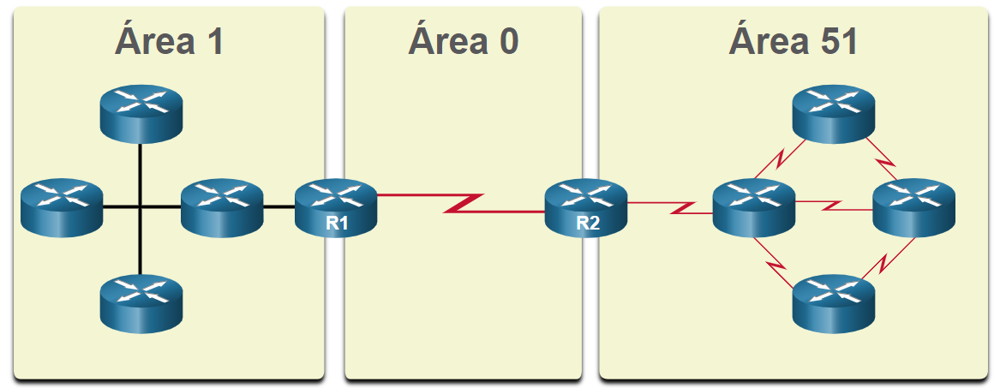

# Comandos OSPF

    # Recursos e características de OSPF
        OSPFv2 é usado para redes IPv4. 
        OSPFv3 é usado para redes IPv6.

    # Componentes do OSPF
            Pacote Hello
            Database Description
            Link-State Request
            Link-State Update
            Pacote de confirmação de link-state
            

        As mensagens OSPF são usadas para criar e manter três bancos de dados OSPF, da seguinte forma:

        Banco de dados de adjacência - Isso cria a tabela de vizinhos.
            - Mostrar tabela de vizinhos
                show ip ospf neighbor

        Banco de dados de estado de link (LSDB) - cria a tabela de topologia.
            - Mostrar tabela de Topologia
                show ip ospf database

        Banco de dados de encaminhamento - Isso cria a tabela de roteamento.
            - Mostrar tabela de roteamento
                show ip route
            

    # Operação Link-State - etapas no processo de roteamento de estado de link

        - Estabelecer Adjacências de Vizinhos
            Os roteadores habilitados para OSPF devem se reconhecer na rede antes que possam compartilhar informações. Um roteador OSPF ativado envia pacotes Hello de todas as interfaces OSPF permitidas para determinar se os vizinhos estão presentes nesses links. Se um vizinho estiver presente, o roteador com OSPF ativado tenta estabelecer uma adjacência de vizinho com aquele vizinho
        
        - Trocar anúncios de estado de link
            Depois que as adjacências são estabelecidas, os roteadores trocam anúncios de estado de link (LSAs). Os LSAs contêm o estado e o custo de cada link diretamente conectado. Os roteadores inundam o LSAs para os vizinhos adjacentes. Os vizinhos adjacentes que recebem o LSA inundam imediatamente todos os outros vizinhos diretamente conectados, até que todos os roteadores da área tenham todos os LSAs.

        - Criar o Banco de Dados de Estado do Link
            Depois que os LSAs são recebidos, os roteadores habilitados para OSPF criam a tabela de topologia (LSDB) com base nos LSAs recebidos. Esse banco de dados contém todas as informações sobre a topologia da área.

        - Executar o algoritmo SPF
            Os roteadores, em seguida, executam o algoritmo SPF. As engrenagens na figura para esta etapa são usadas para indicar a execução do algoritmo SPF. O algoritmo SPF cria a árvore SPF.
            

        - Escolha a melhor rota
           Após a construção da árvore SPF, os melhores caminhos para cada rede são oferecidos para a tabela de roteamento IP. A rota será inserida na tabela de roteamento, a menos que haja uma origem de rota para a mesma rede com uma distância administrativa menor, como uma rota estática. As decisões de roteamento são feitas com base nas entradas da tabela de roteamento. 

    
    # OSPF de área única e multi área
        Para tornar o OSPF mais eficiente e escalável, o OSPF suporta o roteamento hierárquico com o uso de áreas. Uma área OSPF é um grupo de roteadores que compartilham as mesmas informações de link-state nos LSDBs. O OSPF pode ser implementado de uma das duas maneiras a seguir:

        OSPF de área única - Todos os roteadores estão em uma área. A melhor prática é usar a área 0.
        
        OSPF multi área - OSPF é implementado usando várias áreas, de maneira hierárquica. Todas as áreas devem se conectar à área de backbone (área 0). Os roteadores interconectando as áreas são denominados Area Border Routers (ABRs).
        
        O foco deste módulo está no OSPFv2 de área única.

    # OSPF multi área
        Com o OSPF de várias áreas, um domínio de roteamento grande pode ser dividido em áreas menores, para oferecer suporte ao roteamento hierárquico. O roteamento ainda ocorre entre as áreas (roteamento entre áreas), enquanto muitas das operações de roteamento intensivas do processador, como recalcular o banco de dados, são mantidas em uma área.

        Por exemplo, sempre que um roteador recebe novas informações sobre mudanças de topologia na área (incluindo a adição, exclusão ou modificação de um link), o roteador deve executar novamente o algoritmo SPF, criar uma nova árvore SPF e atualizar a tabela de roteamento. O algoritmo SPF exige muito da CPU e o tempo necessário para o cálculo depende do tamanho da área.

        Observação: Os roteadores em outras áreas recebem atualizações sobre alterações na topologia, mas esses roteadores somente atualizam a tabela de roteamento, não executam novamente o algoritmo SPF.

        Muitos roteadores em uma área tornariam o LSDBs muito grande e aumentaria a carga da CPU. Portanto, organizar os roteadores em áreas divide efetivamente um banco de dados potencialmente grande em bancos de dados menores e mais gerenciáveis.

        As opções de design de topologia hierárquica com OSPF de várias áreas podem oferecer as seguintes vantagens:

            - Tabelas de roteamento menores - As tabelas são menores porque há menos entradas de tabela de roteamento. Isso ocorre porque os endereços de rede podem ser resumidos entre áreas. O resumo da rota não é ativado por padrão.
            - Sobrecarga de atualização do estado do link reduzida - Projetar OSPF de várias áreas com áreas menores minimiza os requisitos de processamento e memória.
            - Frequência reduzida de cálculos de SPF - O OSPF de várias áreas localiza o impacto de uma alteração de topologia em uma área. Por exemplo, minimiza o impacto de atualização de roteamento, pois a inundação LSA para na borda de área.
            

    

    # OSPFv3
        OSPFv3 é o equivalente do OSPFv2 para trocar prefixos do IPv6. Lembre-se que no IPv6 o endereço de rede é conhecido como prefixo e a máscara de sub-rede é chamada de tamanho do prefixo.
        Semelhante à sua contraparte do IPv4, o OSPFv3 troca informações de roteamento para preencher a tabela de roteamento IPv6 com prefixos remotos.
        Observação: Com o recurso Famílias de Endereços OSPFv3, o OSPFv3 inclui suporte para IPv4 e IPv6. As linhas de endereço de OSPF não fazem parte do escopo deste currículo.
        O OSPFv2 funcionada na camada de rede do IPv4, comunicando com outros pares IPv4 do OSPF e anunciando somente as rotas IPv4.
        O OSPFv3 tem a mesma funcionalidade que OSPFv2, mas usa o IPv6 como transporte de camada de rede, comunicando com os pares do OSPFv3 e anunciando rotas do IPv6. O OSPFv3 também usa o algoritmo SPF como mecanismo de computação para determinar os melhores caminhos em todo o domínio de roteamento.
        O OSPFv3 possui processos separados de sua contraparte do IPv4. Os processos e as operações são basicamente iguais aos do protocolo de roteamento do IPv4, mas são executados independentemente. OSPFv2 e OSPFv3 têm tabelas de adjacência separadas, tabelas de topologia do OSPF e tabelas de roteamento IP, como mostrado na figura.
        Os comandos de configuração e verificação do OSPFv3 são semelhantes aos usados no OSPFv2.
        

    # Pacotes OSPF
        Tipos de pacotes do OSPF
            Pacotes de estado de link são as ferramentas usadas pelo OSPF para ajudar a determinar a rota mais rápida disponível para um pacote. O OSPF usa os seguintes LSP (link-state packets) para estabelecer e manter adjacências vizinhas e trocar atualizações de roteamento. Cada pacote serve a uma finalidade específica no processo de roteamento OSPF, da seguinte maneira:

            Tipo 1:Pacote de Hello - Isso é usado para estabelecer e manter adjacência com outros roteadores OSPF.
            Tipo 2:Pacote Descrição do Banco de Dados (DBD) - Ele contém uma lista abreviada do LSDB do roteador de envio e é usado pelo recebimento de roteadores para verificar o LSDB local. O LSDB deve ser idêntico em todos os roteadores link-state em uma área para criar uma árvore SPF precisa.
            Tipo 3:Pacote Link-State Request (LSR) - Os roteadores receptores podem solicitar mais informações sobre qualquer entrada no DBD enviando um LSR.
            Tipo 4:Pacote Link-State Update (LSU) - Isso é usado para responder aos LSRs e anunciar novas informações. As LSUs contêm vários tipos diferentes de LSAs.
            Tipo 5:Pacote Link-State Acknowledgement (LSAck) - Quando uma LSU é recebida, o roteador envia um LSAck para confirmar o recebimento da LSU. O campo de dados de LSAck está vazio.
            A tabela resume os cinco tipos diferentes de LSPs usados pelo OSPFv2. O OSPFv3 tem tipos similares de pacote.

            Legenda da tabela
                Tipo	Nome do pacote	                                 Descrição
                1	        Hello	                     Descobre vizinhos e cria adjacências entre eles
                2	 Database Description (DBD)	         Verifica a sincronização de banco de dados entre roteadores
                3	 Link-State Request (LSR)	         Solicita registros específicos de link-state de roteador para roteador
                4	 Link-State Update (LSU)	         Envia registros de link-state especificamente solicitados
                5	 Link-State Acknowledgment (LSAck)	 Confirma os outros tipos de pacotes

    # Atualizações Link State
        Os roteadores trocam inicialmente pacotes DBD Tipo 2, que é uma lista abreviada do LSDB do roteador remetente. Ele é usado pelo recebimento de roteadores para verificar com o LSDB local.
        Um pacote de LSR tipo 3 é usado pelos roteadores de recepção para solicitar mais informações sobre uma entrada na DBD.
        O pacote de LSU tipo 4 é usado para responder a um pacote de LSR.
        Um pacote tipo 5 é usado para confirmar o recebimento de um LSU tipo 4.
        LSUs também são usados para encaminhar atualizações de roteamento do OSPF, como mudanças de link. Especificamente, um pacote LSU pode conter 11 tipos diferentes de LSAs OSPFv2, com alguns dos mais comuns mostrados na figura. O OSPFv3 renomeou vários LSAs e também contém dois LSAs adicionais.
        Observação: Às vezes, a diferença entre os termos LSU e LSA pode ser confusa porque esses termos são frequentemente usados \u200b\u200bde forma intercambiável. No entanto, uma LSU contém um ou mais LSAs.
        

    # Pacote Hello
        O pacote OSPF tipo 1 é o pacote de Hello. Os pacotes Hello são usados para:
        Descobrir vizinhos do OSPF e estabelecer adjacências de vizinhos.
        Anunciar parâmetros nos quais dois roteadores devem concordar para se tornarem vizinhos.
        Escolha o roteador designado (DR) e o roteador designado para backup (BDR) em redes multiacesso como Ethernet. Os links de ponto a ponto não exigem DR ou BDR.    

        - Conteúdo do pacote Hello do OSPF
            

    # Configuração OSPFv2 enm área única

        Objetivo do módulo: Implementar o OSPFv2 de área única nas redes de multiacesso broadcast e ponto a ponto.

                                 Legenda da tabela
            Título do Tópico	                            Objetivo do Tópico
            ID do roteador OSPF	                Configurar uma ID de roteador OSPF.
            Redes OSPF ponto a ponto	        Configurar OSPFv2 de área única em uma rede ponto a ponto.
            Redes OSPF de multiacesso	        Configurar a prioridade da interface OSPF para influenciar a eleição de DR/BDR em uma rede multiacesso.
            Modificar OSPFv2 de área única	    Implementar modificações para alterar a operação de OSPFv2 de área única.
            Propagação de rota padrão	        Configurar o OSPF para propagar uma rota padrão.
            Verificar o OSPFv2 de área única	Verificar uma implementação de OSPFv2 de área única.

    
    # Topologia de Referência de OSPF
       Para começar, este tópico discute a base na qual o OSPF baseia todo seu processo, o ID do roteador OSPF.
        A figura mostra a topologia usada para configurar o OSPFv2 nesse módulo. Os roteadores na topologia têm uma configuração inicial, incluindo endereços de interface. No momento, não há roteamento estático ou dinâmico configurado em qualquer um dos roteadores. Todas as interfaces em R1, R2 e R3 (exceto o loopback 1 no R2) estão dentro da área de backbone do OSPF. O roteador ISP é usado como gateway para a Internet do domínio de roteamento.
        Observação: Nesta topologia, a interface de loopback é usada para simular o link WAN à Internet e uma LAN conectada a cada roteador. Isso é feito para permitir que essa topologia seja duplicada para fins de demonstração em roteadores que têm apenas duas interfaces Gigabit Ethernet. 

        
        